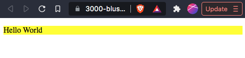

# `05` Create DOM Element (1)

It is possible to create a new DOM element from JavaScript with the function `createElement()`.

```js
let elem = document.createElement("h1");
```

After you create any element, you have to add it to the website's DOM if you want to display it inside the website. To add the element to the DOM we use the function `appendChild()`.

```js
let elem = document.createElement("h1");
elem.innerHTML = "Hello World";
document.body.appendChild(elem);
```

## 📝 Instructions:

1. Using the `createElement()` function, create a paragraph (`p`) element with `yellow` background, set the `innerHTML` to 'Hello World', and finally append it in the document.

## 💻 Expected output:

+ At the end, your website should look like this:



## 💡 Hints:

+ Create a `p` element.

+ Set the `innerHTML`.

+ Remember to set the `yellow` style.

+ `appendChild()` to the document.

## 🔎 Important:

+ The `innerHTML` property of any DOM element is used to set the HTML content that is going to be set inside of that HTML TAG. Don't worry, it's not that complicated!
